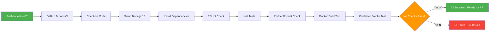
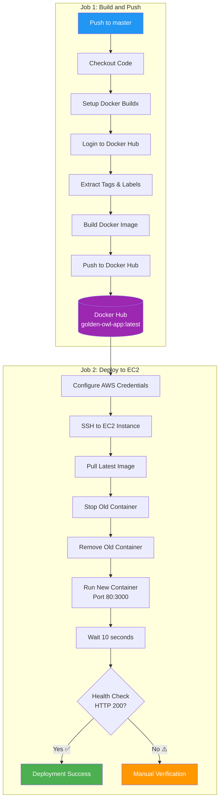
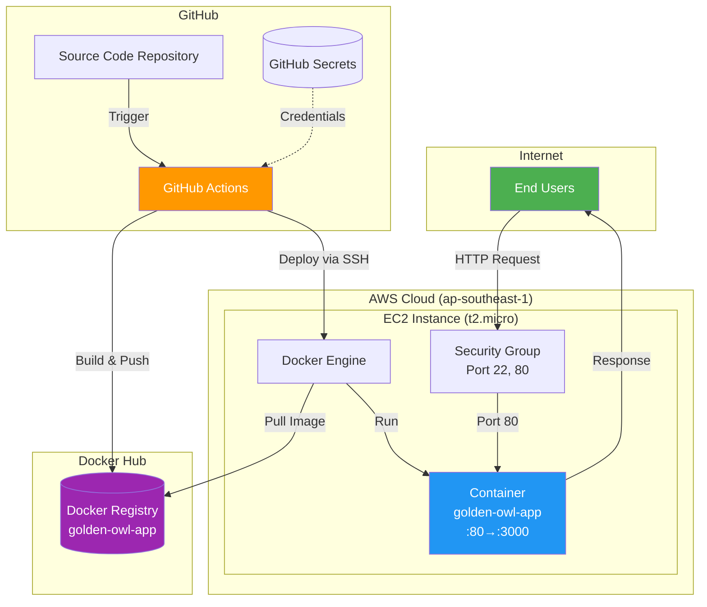
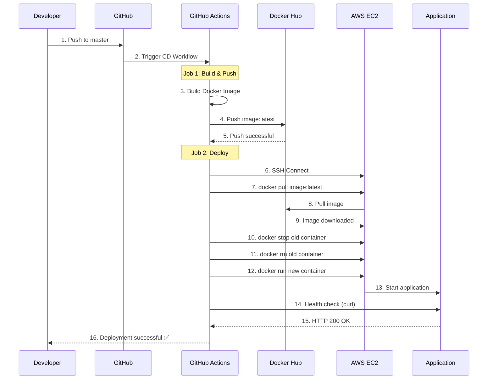
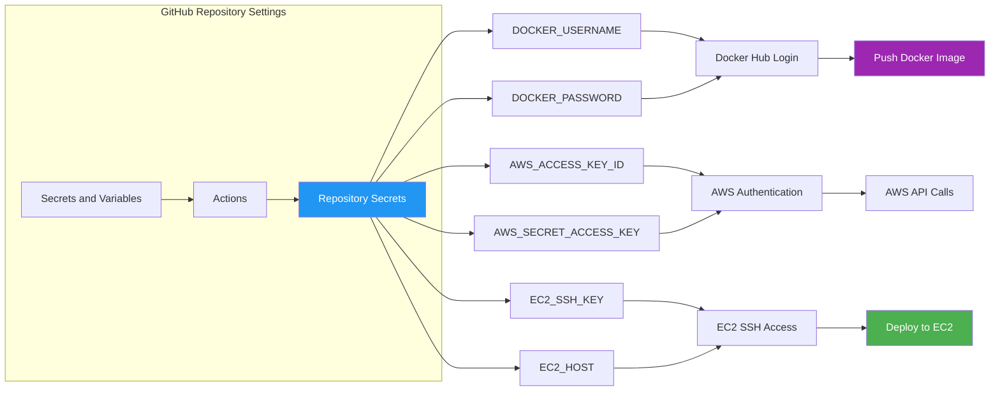
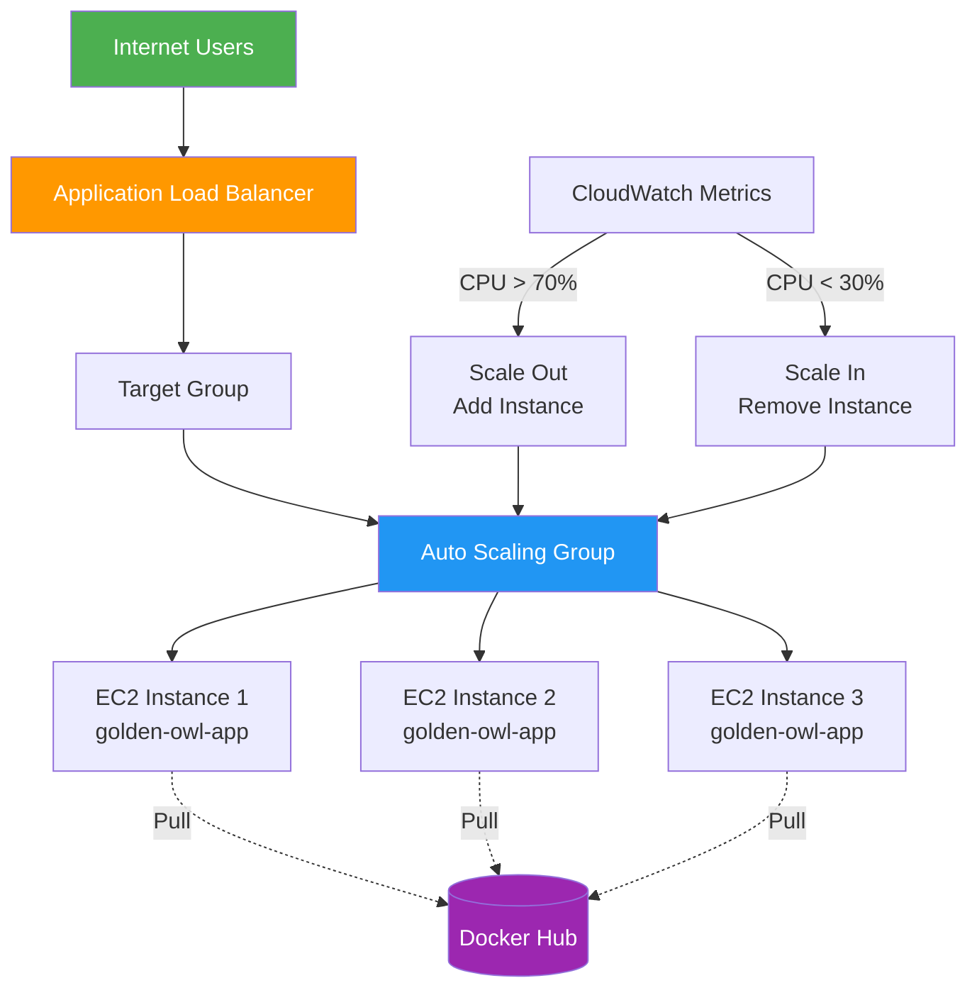
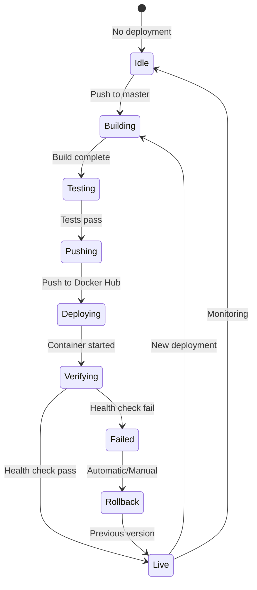
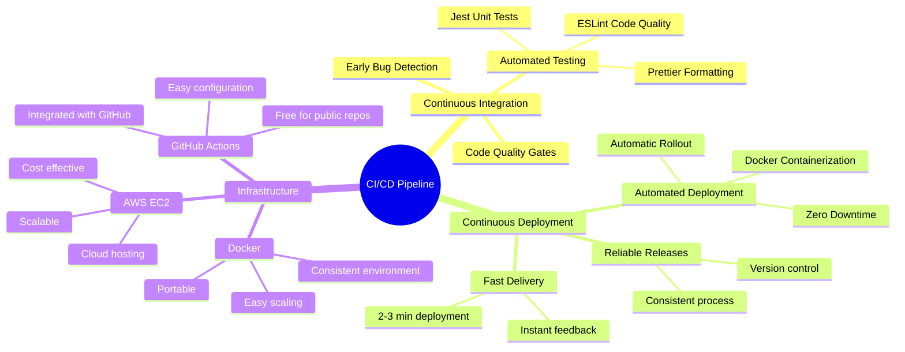

# CI/CD Workflow Diagram

This document provides visual representations of the complete CI/CD pipeline for the Golden Owl DevOps Challenge.

## 1. Complete CI/CD Pipeline Flow

```mermaid
flowchart TB
    Start([Developer pushes code]) --> Branch{Branch?}

    Branch -->|feature/**| CI[CI Workflow Triggered]
    Branch -->|master| CD[CD Workflow Triggered]

    CI --> Checkout1[Checkout Code]
    Checkout1 --> SetupNode[Setup Node.js 18]
    SetupNode --> Install[npm ci]
    Install --> Lint[Run ESLint]
    Lint --> Test[Run Jest Tests]
    Test --> Format[Prettier Check]
    Format --> DockerBuild[Build Docker Image]
    DockerBuild --> DockerTest[Test Container]
    DockerTest --> CIResult{CI Result}

    CIResult -->|Pass ✅| PRReady[Ready for PR]
    CIResult -->|Fail ❌| FixCode[Fix Code & Retry]

    PRReady --> CreatePR[Create Pull Request]
    CreatePR --> Merge[Merge to Master]
    Merge --> CD

    CD --> BuildJob[Job 1: Build & Push]

    BuildJob --> Checkout2[Checkout Code]
    Checkout2 --> SetupDocker[Setup Docker Buildx]
    SetupDocker --> DockerLogin[Login to Docker Hub]
    DockerLogin --> Metadata[Extract Metadata]
    Metadata --> BuildPush[Build & Push Image]
    BuildPush --> Registry[(Docker Hub Registry)]

    Registry --> DeployJob[Job 2: Deploy to EC2]

    DeployJob --> Checkout3[Checkout Code]
    Checkout3 --> AWSCreds[Configure AWS Credentials]
    AWSCreds --> SSHDeploy[SSH to EC2 & Deploy]
    SSHDeploy --> PullImage[Pull Latest Image]
    PullImage --> StopOld[Stop Old Container]
    StopOld --> RemoveOld[Remove Old Container]
    RemoveOld --> StartNew[Start New Container]
    StartNew --> Verify[Verify Deployment]

    Verify --> HealthCheck{Health Check}
    HealthCheck -->|200 OK ✅| Live[Application Live]
    HealthCheck -->|Error ⚠️| ManualCheck[Manual Verification Needed]

    Live --> End([Deployment Complete])
    ManualCheck --> End

    style Start fill:#90EE90
    style CI fill:#87CEEB
    style CD fill:#FFB6C1
    style Live fill:#90EE90
    style End fill:#90EE90
    style CIResult fill:#FFD700
    style HealthCheck fill:#FFD700
    style Registry fill:#DDA0DD
```

## 2. CI Pipeline (Feature Branch)

## 3. CD Pipeline (Master Branch)

## 4. Infrastructure Architecture

## 5. Deployment Sequence Diagram

## 6. GitHub Secrets Configuration

## 7. Optional: Load Balancer & Auto Scaling (Future Enhancement)

## 8. Deployment States

## Key Features Visualization

### CI/CD Benefits

---

## Technology Stack Summary

| Component | Technology | Purpose |
|-----------|-----------|---------|
| **Source Control** | GitHub | Code repository & version control |
| **CI/CD Platform** | GitHub Actions | Automated workflows |
| **Containerization** | Docker | Application packaging |
| **Container Registry** | Docker Hub | Image storage & distribution |
| **Cloud Provider** | AWS | Infrastructure hosting |
| **Compute** | EC2 (t2.micro) | Application server |
| **Runtime** | Node.js 18 | JavaScript runtime |
| **Framework** | Express.js | Web application framework |
| **Testing** | Jest | Unit testing |
| **Linting** | ESLint | Code quality |
| **Formatting** | Prettier | Code style consistency |

---

## Deployment Metrics

**Target Performance:**
- **Build Time:** ~30-60 seconds
- **Push Time:** ~20-30 seconds
- **Deploy Time:** ~30-60 seconds
- **Verification:** ~10 seconds
- **Total Time:** ~2-3 minutes from commit to production

**Reliability:**
- **Success Rate:** >95% (with passing tests)
- **Rollback Time:** <2 minutes
- **Uptime Target:** 99.9%

---

## How to View These Diagrams

These Mermaid diagrams can be viewed in:
1. **GitHub** - Native rendering in README and markdown files
2. **Visual Studio Code** - With Mermaid preview extension
3. **Mermaid Live Editor** - https://mermaid.live
4. **Documentation sites** - GitBook, MkDocs, etc.

Simply copy the mermaid code blocks into any of these tools for interactive viewing!
