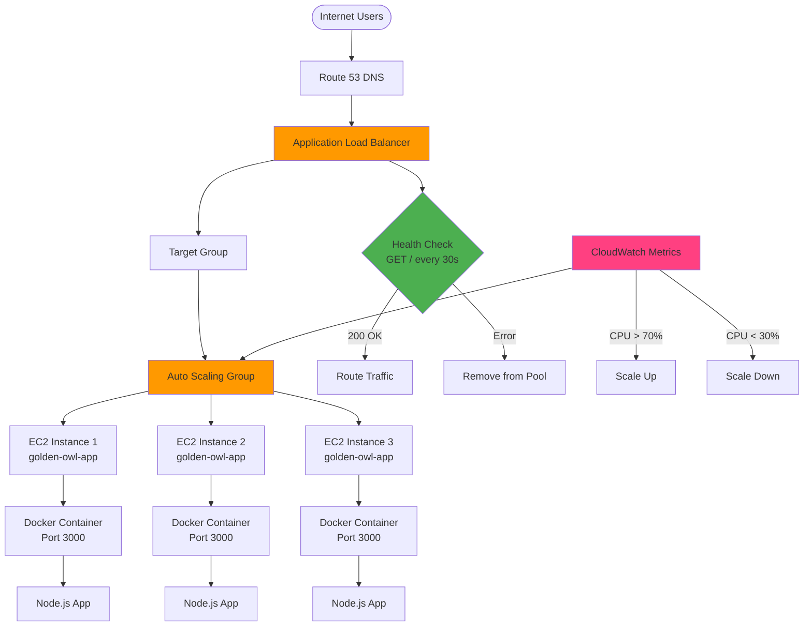

# Load Balancer and Auto Scaling Setup Guide

This guide walks you through implementing a **Load Balancer** and **Auto Scaling** for the Golden Owl application on AWS.

## 🏗️ Architecture Overview



## 📋 Prerequisites

- ✅ Existing EC2 instance with Docker and the app deployed
- ✅ AWS CLI configured
- ✅ VPC with at least 2 subnets in different availability zones

## 🚀 Step-by-Step Implementation

### Step 1: Create an AMI from Your Existing EC2 Instance

**Why?** Auto Scaling needs a template (AMI) to launch new instances.

```bash
# Get your instance ID
INSTANCE_ID="i-0c5dbc4615d20ed81"  # Replace with your EC2 instance ID

# Create AMI
aws ec2 create-image \
  --instance-id $INSTANCE_ID \
  --name "golden-owl-app-$(date +%Y%m%d-%H%M%S)" \
  --description "Golden Owl app with Docker pre-installed" \
  --no-reboot

# Note the AMI ID from the output
AMI_ID="ami-0690ccab4d3e763fa"
```

### Step 2: Create a Launch Template

```bash
# Create launch-template.json
cat > launch-template.json << 'EOF'
{
  "LaunchTemplateName": "golden-owl-launch-template",
  "VersionDescription": "v1.0",
  "LaunchTemplateData": {
    "ImageId": "AMI_ID_PLACEHOLDER",
    "InstanceType": "t2.micro",
    "KeyName": "golden-owl-key",
    "SecurityGroupIds": ["sg-xxxxx"],
    "UserData": "BASE64_ENCODED_USER_DATA",
    "TagSpecifications": [
      {
        "ResourceType": "instance",
        "Tags": [
          {
            "Key": "Name",
            "Value": "golden-owl-app-asg"
          },
          {
            "Key": "Environment",
            "Value": "production"
          }
        ]
      }
    ],
    "IamInstanceProfile": {
      "Name": "EC2-DockerHub-Role"
    }
  }
}
EOF

# Create user data script
cat > user-data.sh << 'EOF'
#!/bin/bash
# Pull and run the latest Docker image
docker pull YOUR_DOCKERHUB_USERNAME/golden-owl-app:latest
docker stop golden-owl-app || true
docker rm golden-owl-app || true
docker run -d -p 80:3000 --name golden-owl-app --restart unless-stopped \
  YOUR_DOCKERHUB_USERNAME/golden-owl-app:latest
EOF

# Encode user data
USER_DATA=$(base64 -w 0 user-data.sh)

# Replace placeholders
sed -i "s/AMI_ID_PLACEHOLDER/$AMI_ID/" launch-template.json
sed -i "s/BASE64_ENCODED_USER_DATA/$USER_DATA/" launch-template.json

# Create the launch template
aws ec2 create-launch-template --cli-input-json file://launch-template.json
```

### Step 3: Create Application Load Balancer

```bash
# Get your VPC ID and subnet IDs
VPC_ID="vpc-0348de8287979ec62"
SUBNET_1="subnet-00c0b832ac5bc8d80"  # Public subnet in AZ 1 - use1-az4 (us-east-1c) -> Destination: 0.0.0.0/0 and Target: igw-0dd70058e41a35ffe
SUBNET_2="subnet-0dc9f3821a4b5cef0"  # Public subnet in AZ 2 - use1-az3 (us-east-1e) -> Destination: 0.0.0.0/0 and Target: igw-0dd70058e41a35ffe

# Create security group for ALB
ALB_SG=$(aws ec2 create-security-group \
  --group-name golden-owl-alb-sg \
  --description "Security group for Golden Owl ALB" \
  --vpc-id $VPC_ID \
  --output text --query 'GroupId')

# Allow HTTP traffic to ALB
aws ec2 authorize-security-group-ingress \
  --group-id $ALB_SG \
  --protocol tcp \
  --port 80 \
  --cidr 0.0.0.0/0

# Create the Application Load Balancer
ALB_ARN=$(aws elbv2 create-load-balancer \
  --name golden-owl-alb \
  --subnets $SUBNET_1 $SUBNET_2 \
  --security-groups $ALB_SG \
  --scheme internet-facing \
  --type application \
  --ip-address-type ipv4 \
  --output text --query 'LoadBalancers[0].LoadBalancerArn')

# Get ALB DNS name
ALB_DNS=$(aws elbv2 describe-load-balancers \
  --load-balancer-arns $ALB_ARN \
  --output text --query 'LoadBalancers[0].DNSName')

echo "ALB DNS: $ALB_DNS"
```

### Step 4: Create Target Group

```bash
# Create target group
TG_ARN=$(aws elbv2 create-target-group \
  --name golden-owl-tg \
  --protocol HTTP \
  --port 80 \
  --vpc-id $VPC_ID \
  --health-check-path / \
  --health-check-interval-seconds 30 \
  --health-check-timeout-seconds 5 \
  --healthy-threshold-count 2 \
  --unhealthy-threshold-count 3 \
  --matcher HttpCode=200 \
  --output text --query 'TargetGroups[0].TargetGroupArn')

echo "Target Group ARN: $TG_ARN"
```

### Step 5: Create ALB Listener

```bash
# Create listener (forwards traffic from ALB to target group)
aws elbv2 create-listener \
  --load-balancer-arn $ALB_ARN \
  --protocol HTTP \
  --port 80 \
  --default-actions Type=forward,TargetGroupArn=$TG_ARN
```

### Step 6: Create Auto Scaling Group

```bash
# Create Auto Scaling Group
aws autoscaling create-auto-scaling-group \
  --auto-scaling-group-name golden-owl-asg \
  --launch-template LaunchTemplateName=golden-owl-launch-template,Version='$Latest' \
  --min-size 2 \
  --max-size 5 \
  --desired-capacity 2 \
  --default-cooldown 300 \
  --health-check-type ELB \
  --health-check-grace-period 300 \
  --vpc-zone-identifier "$SUBNET_1,$SUBNET_2" \
  --target-group-arns $TG_ARN \
  --tags Key=Name,Value=golden-owl-asg-instance,PropagateAtLaunch=true
```

### Step 7: Configure Auto Scaling Policies

#### Scale Up Policy (when CPU > 70%)

```bash
# Create scale-up policy
SCALE_UP_ARN=$(aws autoscaling put-scaling-policy \
  --auto-scaling-group-name golden-owl-asg \
  --policy-name scale-up-on-cpu \
  --scaling-adjustment 1 \
  --adjustment-type ChangeInCapacity \
  --cooldown 300 \
  --output text --query 'PolicyARN')

# Create CloudWatch alarm for scale-up
aws cloudwatch put-metric-alarm \
  --alarm-name golden-owl-cpu-high \
  --alarm-description "Scale up when CPU exceeds 70%" \
  --metric-name CPUUtilization \
  --namespace AWS/EC2 \
  --statistic Average \
  --period 300 \
  --threshold 70 \
  --comparison-operator GreaterThanThreshold \
  --evaluation-periods 2 \
  --alarm-actions $SCALE_UP_ARN \
  --dimensions Name=AutoScalingGroupName,Value=golden-owl-asg
```

#### Scale Down Policy (when CPU < 30%)

```bash
# Create scale-down policy
SCALE_DOWN_ARN=$(aws autoscaling put-scaling-policy \
  --auto-scaling-group-name golden-owl-asg \
  --policy-name scale-down-on-cpu \
  --scaling-adjustment -1 \
  --adjustment-type ChangeInCapacity \
  --cooldown 300 \
  --output text --query 'PolicyARN')

# Create CloudWatch alarm for scale-down
aws cloudwatch put-metric-alarm \
  --alarm-name golden-owl-cpu-low \
  --alarm-description "Scale down when CPU below 30%" \
  --metric-name CPUUtilization \
  --namespace AWS/EC2 \
  --statistic Average \
  --period 300 \
  --threshold 30 \
  --comparison-operator LessThanThreshold \
  --evaluation-periods 2 \
  --alarm-actions $SCALE_DOWN_ARN \
  --dimensions Name=AutoScalingGroupName,Value=golden-owl-asg
```

### Step 8: Update EC2 Security Group

Allow traffic from ALB to EC2 instances:

```bash
# Get EC2 security group ID
EC2_SG="sg-08ff8a6f238ed8e14"  # Your EC2 security group

# Allow traffic from ALB security group
aws ec2 authorize-security-group-ingress \
  --group-id $EC2_SG \
  --protocol tcp \
  --port 80 \
  --source-group $ALB_SG
```

## 🧪 Testing

### Test Load Balancer

```bash
# Test the ALB endpoint
curl http://$ALB_DNS
# Expected: {"message":"Welcome warriors to Golden Owl!"}
```

### Test Auto Scaling

```bash
# Stress test to trigger scale-up (run on one of your EC2 instances)
# SSH into instance first
ssh -i your-key.pem ec2-user@instance-ip

# Install stress tool
sudo yum install -y stress

# Run stress test (increase CPU to 100% for 5 minutes)
stress --cpu 4 --timeout 300s

# Watch auto scaling in action
aws autoscaling describe-auto-scaling-groups \
  --auto-scaling-group-names golden-owl-asg \
  --query 'AutoScalingGroups[0].[DesiredCapacity,MinSize,MaxSize]'
```

### Monitor Health Checks

```bash
# Check target health
aws elbv2 describe-target-health \
  --target-group-arn $TG_ARN
```

## 📊 Monitoring

### CloudWatch Dashboard

Access metrics at: AWS Console → CloudWatch → Dashboards

Key metrics to monitor:
- **ALB Metrics**:
  - RequestCount
  - TargetResponseTime
  - HTTPCode_Target_2XX_Count
  - UnHealthyHostCount

- **Auto Scaling Metrics**:
  - GroupDesiredCapacity
  - GroupInServiceInstances
  - GroupMinSize / GroupMaxSize

- **EC2 Metrics**:
  - CPUUtilization
  - NetworkIn/NetworkOut

## 🔧 Configuration Summary

| Component | Value |
|-----------|-------|
| **Min Instances** | 2 |
| **Max Instances** | 5 |
| **Desired Capacity** | 2 |
| **Scale Up Threshold** | CPU > 70% |
| **Scale Down Threshold** | CPU < 30% |
| **Health Check Path** | `/` |
| **Health Check Interval** | 30 seconds |
| **Cooldown Period** | 5 minutes |

## 🎯 Expected Results

After setup:
- ✅ Load Balancer distributes traffic across multiple instances
- ✅ Health checks remove unhealthy instances automatically
- ✅ Auto Scaling adds instances during high load
- ✅ Auto Scaling removes instances during low load
- ✅ High availability across multiple availability zones
- ✅ Zero downtime during deployments

## 🔄 Updating Your Application

When deploying new versions:

```bash
# Update the AMI
# Create new AMI from updated instance
NEW_AMI_ID=$(aws ec2 create-image \
  --instance-id $INSTANCE_ID \
  --name "golden-owl-app-$(date +%Y%m%d-%H%M%S)" \
  --no-reboot \
  --output text --query 'ImageId')

# Update launch template
aws ec2 create-launch-template-version \
  --launch-template-name golden-owl-launch-template \
  --source-version 1 \
  --launch-template-data "ImageId=$NEW_AMI_ID"

# Set new version as default
aws ec2 modify-launch-template \
  --launch-template-name golden-owl-launch-template \
  --default-version '$Latest'

# Instance refresh (rolling update)
aws autoscaling start-instance-refresh \
  --auto-scaling-group-name golden-owl-asg \
  --preferences MinHealthyPercentage=50,InstanceWarmup=300
```

## 💰 Cost Optimization

- Use **t2.micro** instances (free tier eligible)
- Set reasonable min/max capacity
- Use **scheduled scaling** for predictable load patterns
- Enable **ALB access logs** only when needed

## 🧹 Cleanup (if needed)

```bash
# Delete Auto Scaling Group
aws autoscaling delete-auto-scaling-group \
  --auto-scaling-group-name golden-owl-asg \
  --force-delete

# Delete Launch Template
aws ec2 delete-launch-template \
  --launch-template-name golden-owl-launch-template

# Delete Load Balancer
aws elbv2 delete-load-balancer --load-balancer-arn $ALB_ARN

# Delete Target Group
aws elbv2 delete-target-group --target-group-arn $TG_ARN

# Delete CloudWatch Alarms
aws cloudwatch delete-alarms \
  --alarm-names golden-owl-cpu-high golden-owl-cpu-low
```

## 📚 Additional Resources

- [AWS Application Load Balancer](https://docs.aws.amazon.com/elasticloadbalancing/latest/application/)
- [AWS Auto Scaling](https://docs.aws.amazon.com/autoscaling/)
- [CloudWatch Metrics](https://docs.aws.amazon.com/cloudwatch/)

---

**Note**: Replace all placeholder values (AMI IDs, instance IDs, VPC IDs, subnet IDs, security group IDs) with your actual values before running the commands.
